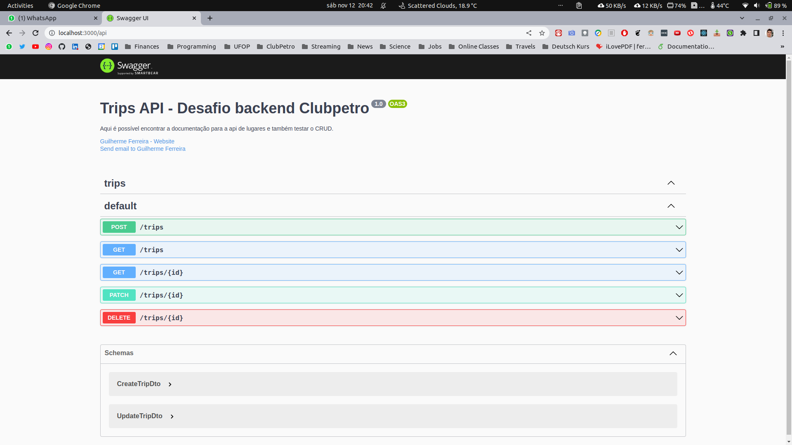

# Desafio de Backend

## Tecnologias usadas

- Framework [NestJS](https://nestjs.com/)
- [Typescript](https://www.typescriptlang.org/)
- [TypeORM](https://typeorm.io/#/)
- [Docker](https://www.docker.com/) para criação do banco de dados Postgrees
- Extensão [Rest client](https://marketplace.visualstudio.com/items?itemName=humao.rest-client) para execução das queries
- [Swagger](https://swagger.io/), para documentação automática da api.

## Execução da aplicação

Com este repositório clonado na sua máquina, entre no diretório raíz. 

Com o docker instalado na maquina, rode o seguinte comando para rodar o container docker e, portanto, instalar o banco de dados: `sudo docker run -e POSTGRES_USER=guiinow -e POSTGRES_PASSWORD=123456 -p 5432:5432 -d postgres:14.5`

Para rodar o servidor de desenvolvimento: `npm run start:dev`
Repare que é mandatório ter o ambiente nodejs intalado: node.js, npm e nestjs

Agora a aplicação já estará rodando

## Teste da aplicação

Há duas formas principais para testar a aplicação, a primeira e mais recomendada é atravez do swagger.

Com a aplicação rodando, vá para a seguinte rota: http://localhost:3000/api
Aqui, você verá a seguinte tela: 

Por fim, nesta primeira forma de teste você poderar observar como o CRUD foi estruturado e poderá, também, realizar testes.

A segunda forma principal de teste é usando uma extensão de Rest Client dentro do VS Code.
Vá ao diretório api-queries, abra o arquivo **queries.http** e lá você poderá alterar os payloads e executar as queries.